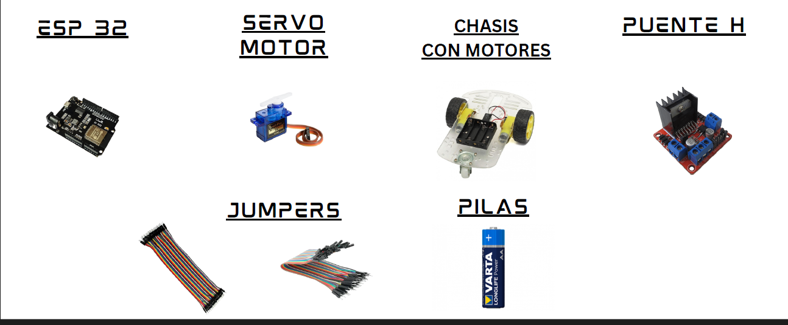

# Garbage Eating Monster

En un mundo cada vez más automatizado, surge la necesidad de robots versátiles capaces de adaptarse a diversos entornos y tareas. **Garbage Eating Monster** es un proyecto enfocado en el desarrollo de un robot multifuncional con movimiento omnidireccional y capacidad para recoger y trasladar objetos de manera eficiente. Este robot representa una solución adaptable para aplicaciones en logística, automatización industrial y manejo de residuos.

---

## Tabla de Contenidos

- [Características del Proyecto](#características-del-proyecto)
- [Problema y Necesidad](#problema-y-necesidad)
- [Objetivos](#objetivos)
- [Tecnologías y Materiales Utilizados](#tecnologías-y-materiales-utilizados)
- [Funcionamiento](#funcionamiento)
- [Guía de Instalación](#guía-de-instalación)
- [Instrucciones para Subir el Código al ESP32](#Instrucciones-para-Subir-el-Código-al-ESP32)
- [Multimedia](#multimedia)

---

## Características del Proyecto

- Movimiento omnidireccional mediante ruedas mecanum.
- Control remoto por Wi-Fi usando ESP32.
- Capacidad de recolección de objetos mediante servo.
- Transición entre modos de navegación libre y recolección.
- Adaptabilidad para diferentes aplicaciones logísticas e industriales.

---

## Problema y Necesidad

En entornos logísticos e industriales se requiere de soluciones autónomas que puedan optimizar el transporte y clasificación de materiales. Este proyecto nace de la necesidad de un robot que combine movilidad versátil y capacidad de interacción física con objetos, mejorando los procesos de recolección y distribución.

---

## Objetivos

### Objetivo General

Diseñar y construir un robot móvil omnidireccional con capacidades de recolección de objetos, operado mediante control remoto.

### Objetivos Específicos

1. Diseñar la estructura mecánica del robot con ruedas omnidireccionales.
2. Programar el ESP32 para sincronizar motores y servo mediante control Wi-Fi.
3. Implementar algoritmos que permitan alternar entre modos de movimiento libre y recolección.

---

## Tecnologías y Materiales Utilizados

- **Lenguaje de programación:** Arduino
- **Microcontrolador:** ESP32
- **Motores:** Servo motor, motores de tracción
- **Estructura:** Chasis, cartón madera, cartón paja, pintura
- **Electrónica:** Puente H, jumpers, pilas

---

## Funcionamiento

El robot se desplaza omnidireccionalmente gracias a las ruedas mecanum, permitiendo movimientos precisos. Utiliza un brazo con servo para recoger objetos, operado por un control remoto vía Wi-Fi. Su lógica permite alternar entre movimientos de exploración libre y acciones específicas de recolección.

---

## Guía de Instalación

1. **Clonar el repositorio**
```bash
git clone https://github.com/Santiageoff/Garbage-Eating-Monster.git
```
⚠️**Preferible ejecutar el codigo Proyecto_final en Arduino**, luego de esto se creara una ip que es la que tiene los controles de arriba, abajo, izquierda, derecha y diagonal para poder mover el carro 


## Instrucciones para Subir el Código al ESP32

### 1. Abrir el archivo en Arduino IDE

- Abre el archivo `Proyecto_final.ino` en el entorno de desarrollo **Arduino IDE**.

### 2. Configurar Arduino IDE

Asegúrate de:

- Seleccionar la placa **ESP32** correspondiente en `Herramientas > Placa`.
- Configurar correctamente el **puerto COM**.
- Tener instaladas las siguientes librerías:
  - `WiFi.h`
  - `ESPAsyncWebServer.h`
  - `ESPAsyncTCP.h`
  - `ESP32Servo.h`

### 3. Modificar Red Wi-Fi ⚠️

En el código, actualiza los siguientes valores para que coincidan con el nombre y la contraseña de la red Wi-Fi del lugar donde se ejecutará el robot:

```cpp
const char* ssid = "TU_NOMBRE_DE_RED";
const char* password = "TU_CONTRASEÑA";
```

## Multimedia 

- **Materiales**  
  

- **Planos Conexión**  
  

- **Planos Estructura**  
  
  

- **Componenetes**  
  

- **Frente**  
  

- **Carro**  
  

⚠️ Por Ultimo **El codigo para la Camara Aun no se sabe si funciona** se podria mejorar ya arreglar para que este proyecto funcione con una camara para un esp32 pero por el momento este en fase de desarrollo para un futuro